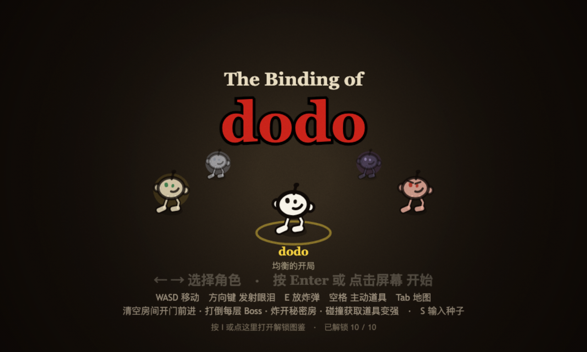
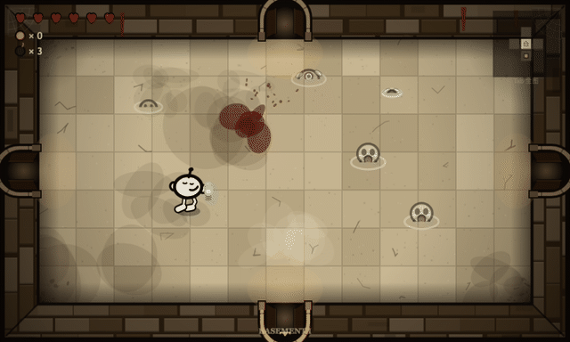

# The Binding of dodo

- 创作者 / Creators: [waterbird-i](https://github.com/waterbird-i)
- 试玩链接 / Playable link: <https://waterbird-i.github.io/the-binding-of-dodo/>
- 当前版本 / Current version: v0.10.0
- 源码或项目仓库 / Source or project repository: <https://github.com/waterbird-i/the-binding-of-dodo>
- 相关点子、Issue 或 PR / Related idea, Issue, or PR: 首个归档，暂无关联

## 怎么玩 / How to play

致敬《以撒的结合》(The Binding of Isaac) 的俯视角肉鸽地牢网页游戏：操控 dodo 在随机生成的地牢里探索，用眼泪消灭敌人、拾取道具滚雪球变强，打穿 12 层，最后面对隐藏 Boss。

- 移动 WASD · 射击方向键 ↑↓←→（四向）
- P 暂停 · E 炸弹 · 空格 主动道具 · Tab 全图 · I 解锁图鉴
- 移动端：左侧虚拟摇杆移动，右侧四向按钮射击，另有「炸弹」「道具」悬浮按钮
- 零依赖、零构建、零素材文件，浏览器打开即玩；公开版为纯单机，全服排行榜仅内网部署版提供

## 想验证什么 / Feedback wanted

- 引导是否清楚：第一层不查说明，能自己摸清「眼泪方向 + 四向射击」吗？
- 操作手感：四向射击（无瞄准）是否顺手，还是更想要 360° 瞄准？
- 难度曲线：按「会走位的普通人」标定，普通玩家前几层会不会卡关或被劝退？

## 制作记录与更新 / Making-of notes and updates

整个游戏由 AI 编程完成，人类负责提需求与验收：12 层地牢、14 个 Boss、47 种专属招式、89 件道具、5 个可选角色，所有图形由 Canvas 代码绘制、音效由 WebAudio 实时合成，仓库里没有一张图片、一个音频文件。

约 10000 行原生 JavaScript，另有约 4000 行 Playwright 测试（377 条断言）盯着它别坏。完整版本演进见仓库 [CHANGELOG.md](https://github.com/waterbird-i/the-binding-of-dodo/blob/main/CHANGELOG.md)。

- v0.10.0（当前）：Boss 血量规则与迷失 dodo 数值重做，怒气强化奖励保底

## 署名 / Credits

- 作者：waterbird-i（AI 辅助编程：需求、验收与玩法设计由作者完成，代码由 AI 生成）
- 本作是 Edmund McMillen 与 Florian Himsl《The Binding of Isaac》的致敬性同人作品，与原作者、发行商均无关联；仓库内所有图形与音效均为程序化生成，不含任何原作美术、音频或代码资源。
